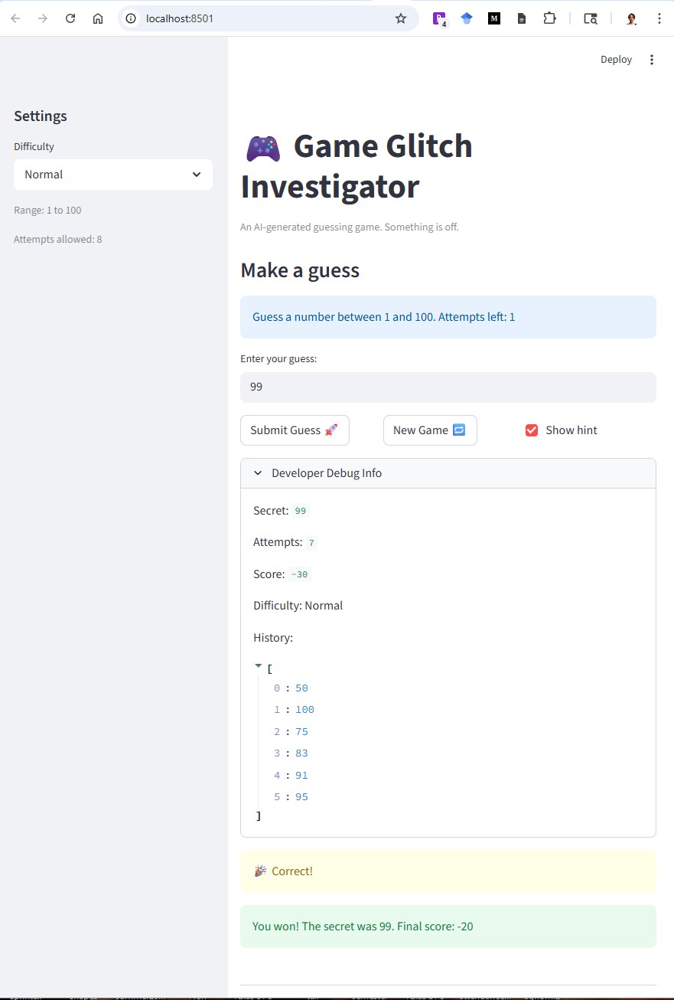

# 🎮 Game Glitch Investigator: The Impossible Guesser

## 🚨 The Situation

You asked an AI to build a simple "Number Guessing Game" using Streamlit.
It wrote the code, ran away, and now the game is unplayable. 

- You can't win.
- The hints lie to you.
- The secret number seems to have commitment issues.

## 🛠️ Setup

1. Install dependencies: `pip install -r requirements.txt`
2. Run the broken app: `python -m streamlit run app.py`

## 🕵️‍♂️ Your Mission

1. **Play the game.** Open the "Developer Debug Info" tab in the app to see the secret number. Try to win.
2. **Find the State Bug.** Why does the secret number change every time you click "Submit"? Ask ChatGPT: *"How do I keep a variable from resetting in Streamlit when I click a button?"*
3. **Fix the Logic.** The hints ("Higher/Lower") are wrong. Fix them.
4. **Refactor & Test.** - Move the logic into `logic_utils.py`.
   - Run `pytest` in your terminal.
   - Keep fixing until all tests pass!

## 📝 Document Your Experience

- [The game’s purpose is to have the player guess a randomly chosen secret number using Higher/Lower hints ] Describe the game's purpose.
- [ I found three main bugs: (1) the secret number was being regenerated on each submit because of Streamlit reruns/state handling, so the target kept changing, (2) the hint logic was inverted, showing incorrect “Higher/Lower” feedback, and (3) the Enable/Disable control was not wired to game behavior, so toggling it did not actually change anything.] Detail which bugs you found.
- [ I fixed the app by storing the secret number in persistent session state so it no longer resets on each submit, correcting the Higher/Lower comparison logic so hints match the guess, and wiring the Enable/Disable toggle to actually control whether gameplay actions are active.] Explain what fixes you applied.

## 📸 Demo

- [ ] 

## 🚀 Stretch Features

- [ ] [If you choose to complete Challenge 4, insert a screenshot of your Enhanced Game UI here]
